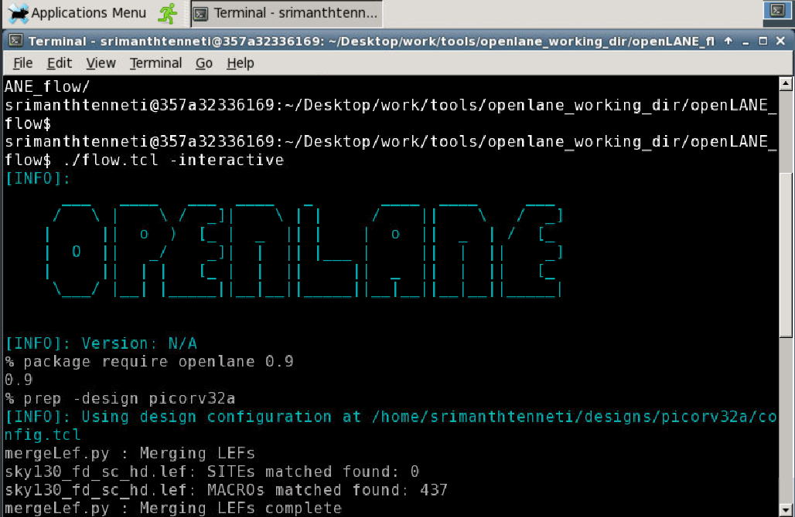
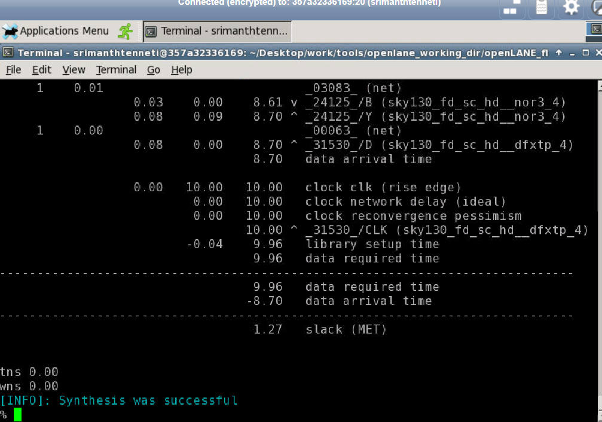

# VSD-Advanced-Physical-Design-Workshop
This workshop aims to give an idea on Physical Design using the 130nm Google Skywater PDK. This is a 5 day workshop focusing on various aspects of physical design. 

## Table of Contents
### 1. Day 1: Inception of open-source EDA, OpenLANE and Sky130 PDK
    1.How to talk to computers
    2.SoC design and OpenLANE
    3.Starting RISC-V SoC Reference design
    4.Get familiar to open-source EDA tools
### 2. Day 2: Understand importance of good floorplan vs bad floorplan and introduction to library cells
    1.Chip Floor planning considerations
    2.Library Binding and Placement
    3.Cell design and characterization flows
    4.General timing characterization parameters
### 3. Day 3: Design and characterize one library cell using Magic Layout tool and ngspice
    1.Labs for CMOS inverter ngspice simulations
    2.Inception of Layout – CMOS fabrication process
    3.Sky130 Tech File Labs
### 4. Day 4: Pre-layout timing analysis and importance of good clock tree
    1.Timing modelling using delay tables
    2.Timing analysis with ideal clocks using openSTA
    3.Clock tree synthesis TritonCTS and signal integrity
    4.Timing analysis with real clocks using openSTA
### 5. Day 5: Final steps for RTL2GDS
    1.Routing and design rule check (DRC)
    2.PNR interactive flow tutorial

## Tools used in the workshop
    1.Yosys – for Synthesis
    2.Magic – for Layout and Floorplanning
    3.CTS - TritonCTS - Synthesizes the clock distribution network
    4.NgSpice - for Characterisation
    5.OpenSTA – Pre-layout and Post-layout Static timing analysis
    
## Day 1 : Inception of open-source EDA, OpenLANE and Sky130 PDK
#### Introduction to the files
1. Skywater-pdk – Contains all the foundry provided PDK related files
2. Open_pdks – Contains scripts that are used to bridge the gap between closed-source and open-source PDK to EDA tool compatibility
3. Sky130A – The open-source compatible PDK files
#### Activating Open Lane & Preparing design

##### Running Openlane
    ./flow.tcl is the script which runs the OpenLANE flow and -interactive starts the flow in the interactive mode. 
##### Preparing design
    prep -design picorv32a

#### Running synthesis
    run_synthesis command synthesizes the design

