# VSD-Advanced-Physical-Design-Workshop
This workshop aims to give an idea on Physical Design using the 130nm Google Skywater PDK. This is a 5 day workshop focusing on various aspects of physical design. 

## Table of Contents
### 1. Day 1: Inception of open-source EDA, OpenLANE and Sky130 PDK
    1.How to talk to computers
    2.SoC design and OpenLANE
    3.Starting RISC-V SoC Reference design
    4.Get familiar to open-source EDA tools
### 2. Day 2: Understand importance of good floorplan vs bad floorplan and introduction to library cells
    1.Chip Floor planning considerations
    2.Library Binding and Placement
    3.Cell design and characterization flows
    4.General timing characterization parameters
### 3. Day 3: Design and characterize one library cell using Magic Layout tool and ngspice
    1.Labs for CMOS inverter ngspice simulations
    2.Inception of Layout – CMOS fabrication process
    3.Sky130 Tech File Labs
### 4. Day 4: Pre-layout timing analysis and importance of good clock tree
    1.Timing modelling using delay tables
    2.Timing analysis with ideal clocks using openSTA
    3.Clock tree synthesis TritonCTS and signal integrity
    4.Timing analysis with real clocks using openSTA
### 5. Day 5: Final steps for RTL2GDS
    1.Routing and design rule check (DRC)
    2.PNR interactive flow tutorial

## Tools used in the workshop
    1.Yosys – for Synthesis
    2.Magic – for Layout and Floorplanning
    3.CTS - TritonCTS - Synthesizes the clock distribution network
    4.NgSpice - for Characterisation
    5.OpenSTA – Pre-layout and Post-layout Static timing analysis
    
## Day 1 : Inception of open-source EDA, OpenLANE and Sky130 PDK
#### Introduction to the files
1. Skywater-pdk – Contains all the foundry provided PDK related files
2. Open_pdks – Contains scripts that are used to bridge the gap between closed-source and open-source PDK to EDA tool compatibility
3. Sky130A – The open-source compatible PDK files
#### Activating Open Lane & Preparing design

##### Running Openlane
    ./flow.tcl is the script which runs the OpenLANE flow and -interactive starts the flow in the interactive mode. 
##### Preparing design
    prep -design picorv32a

#### Running synthesis
    run_synthesis command synthesizes the design

## Day 2: Understand importance of good floorplan vs bad floorplan and introduction to library cells
In the floor planning stage we set some parameters and place plan the area of the chip. The parameters we typically set are :

    1. Die Area : The area of the chip
    2. Core Area : Area for all the circutry
    3. Core Utilization : It is the ratio of area of netlist to area of the core
    4. Aspect Ratio : It is the ratio of width to height
    5. Pre-placed Cells : These IP blocks have user defined locations and are placed in the chip before place and route.
    6. Place i/o pins :  This is to use the netlist to determine where a specific pin should be placed
    7. Power Distribution Network : This is very important to ensure all the components get enough power to function properly
    
#### Running the floorplan
    run_floorplan is the command to run the floor plan
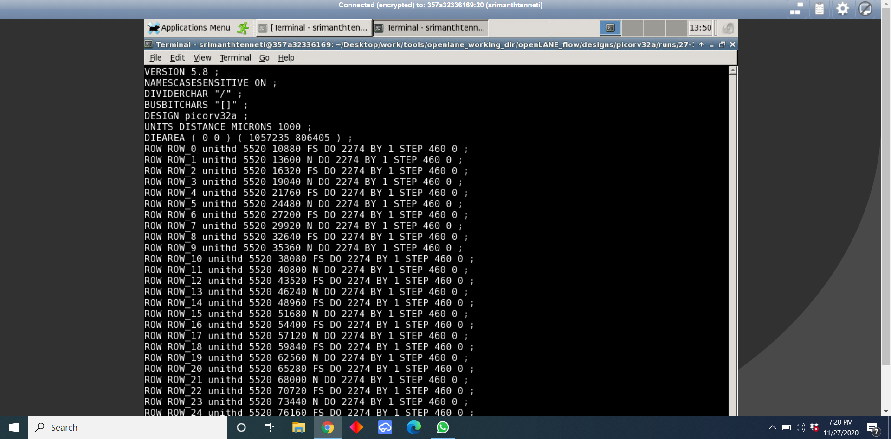
#### Viewing the floorplan
We use the Magic tool to view the floorplan and for us to view it in magic we need 3 files:
1. Magic Tech file : sky130A.tech
2. LEF file : merged.lef
3. Def file of floorplan : picorv32a.floorplan.def

        magic -T <location of techfile> lef read <loction of lef file> def read <location of floorplan def file>
The above command can be used to view the floorplan in the Magic tool.

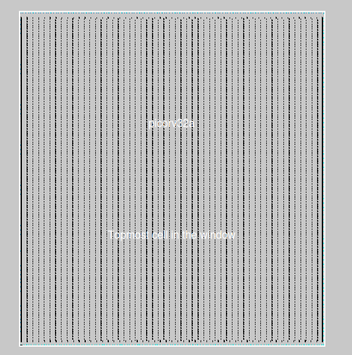

#### Running the Placement
    run_placement command is used to run the placement 
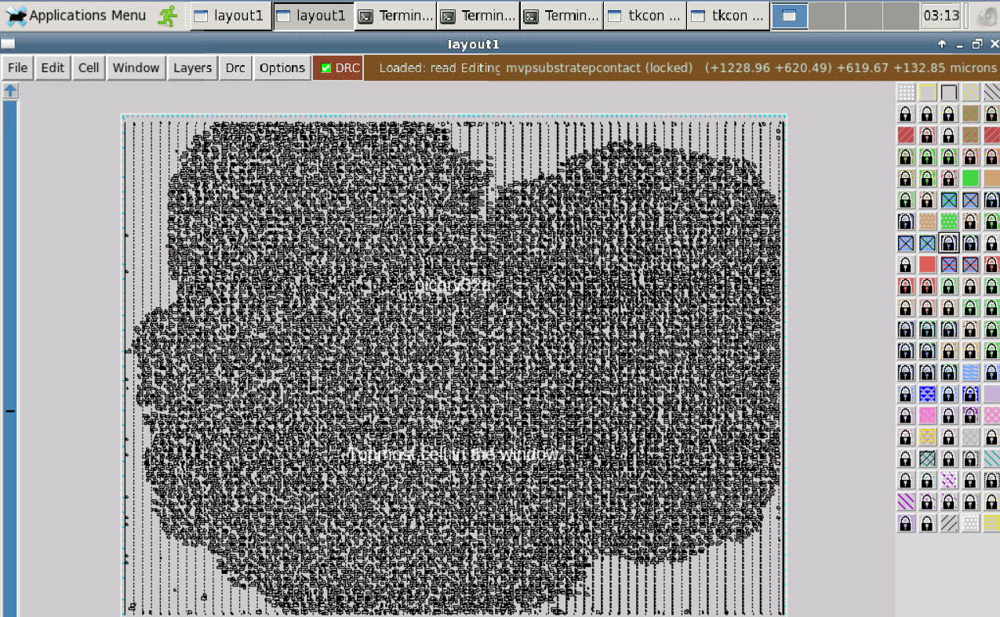

 Also I did a small experiment with the parameters to look at the difference in placement. The above one is the design with all the default parameters and the one below is the design with the parameters prescribed in the workshop.

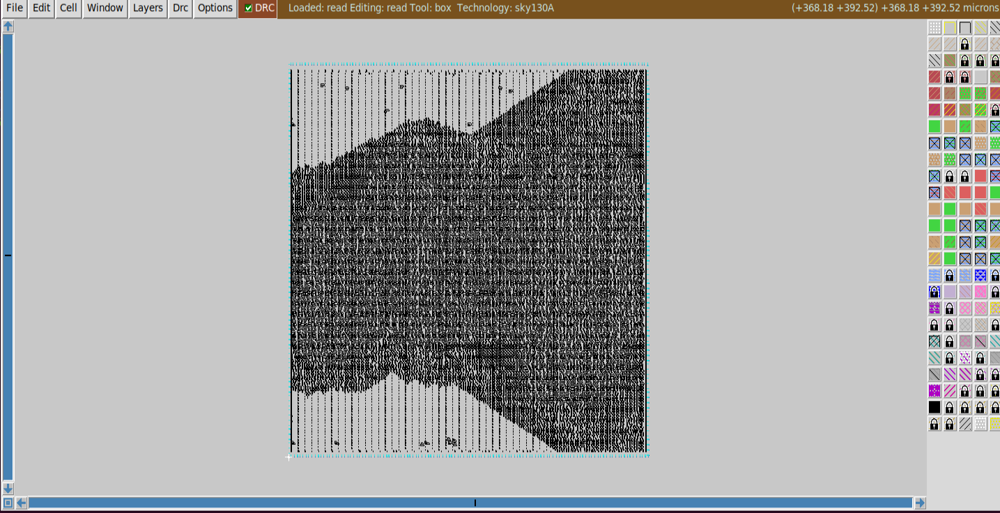

#### Standard Cell Design
The typical standard cell design flow consists of 3 elements : 

    1. Inputs - PDKs , DRC & LVS rules, SPICE models, library & user-defined specs
    2. Design Steps - Circuit design, layout design, characterization
    3. Outputs - CDL, GDSII, LEF, .cir
    
## Day 3: Design and characterize one library cell using Magic Layout tool and ngspice
#### Spice Simulations (Pre-Layout)
The spice simulations mainly consist of : 

    1. Spice deck 
    2. NGspice introduction
    3. static behaviour evaluation 
    
##### Note:
For information on the 16 Mask CMOS process do refer this PDF.

    Link : https://www.vlsisystemdesign.com/wp-content/uploads/2017/07/16-mask-process.pdf
    
#### Lab
For the lab we need to clone a repo for the designs

    Link : git clone https://github.com/nickson-jose/vsdstdcelldesign.git
    
After cloning the repo we need to go into the vsdstdcelldesign directory and view the sky130_inv.mag file using magic. 

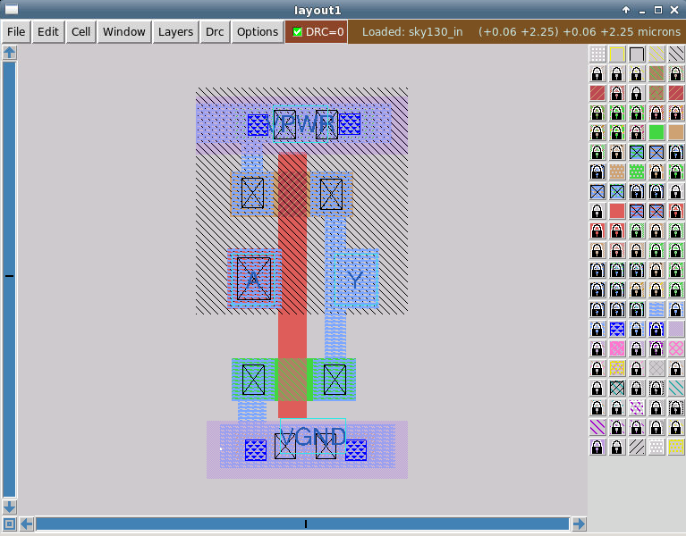

##### Note : 
We need to extract the the parasitics and characterize the design. We use the tkcon window and run the following commands:

    1. extract all
    2. ext2spice cthresh 0 rthresh 0
    3. ext2spice
 
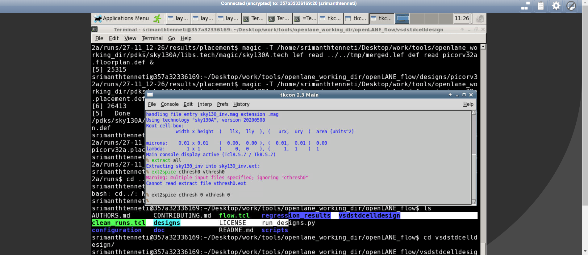   

The extracted file looks like this : 

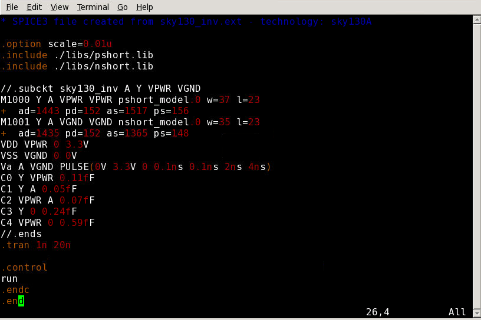   

The next step is running NGspice & this is done using the command : 

    ngspice sky130_inv.spice and we have to plot y vs time a
    
The plot will look something like : 

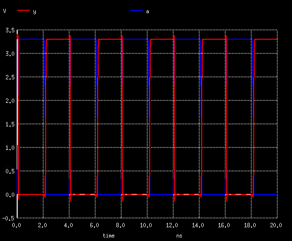 

The next step is to create a .lef file that will be used by the flow.

## Day 4 : 4: Pre-layout timing analysis and importance of good clock tree
#### Lef file generation
To get the lef file we first need to modify the grid. This can be done from the tkcon window by using : 

    grid 0.46um 0.34um 0.23um 0.17um
    
Now save the mag file and restart the magic tool. Then use the following command to generate the lef file : 

     lef write
     
The above command generates a .lef file. Now copy the lef file into the picrorv32a directory using the following command : 

    cp <path to the file> <path to the target location>
    
Also copy the .lib files in the same src folder for timing analysis (the .lib files can be found at libs folder of \vsdstdcelldesign).

To include the cell in the design flow use the following command : 

    set ::env(EXTRA_LEFS) [glob $::env(OPENLANE_ROOT)/designs/$::env(DESIGN_NAME)/src/*.lef]
    
After running design prep use the following commands before running synthesis. 

    set lefs [glob $::env(DESIGN_DIR)/src/*.lef]
    add_lefs -src $lefs
    
After completing the steps view the merged lef file.

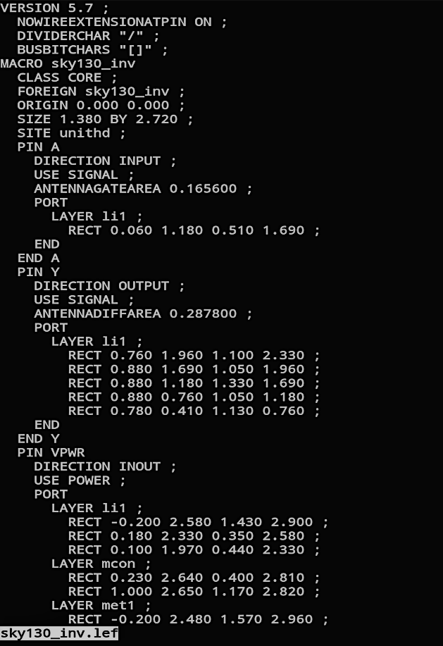 

Now we run a post synthesis analysis using OpenSTA using the command : 

     sta pre_sta.conf
     
After the analysis we will now run the CTS (Clock Tree Synthesis) using the following commands : 

    write_verilog ......../picorv32a.synthesis.v to update the synthesis

After which we have to redo the floorplan and placement. Then we run the CTS using : 

    run_cts
    
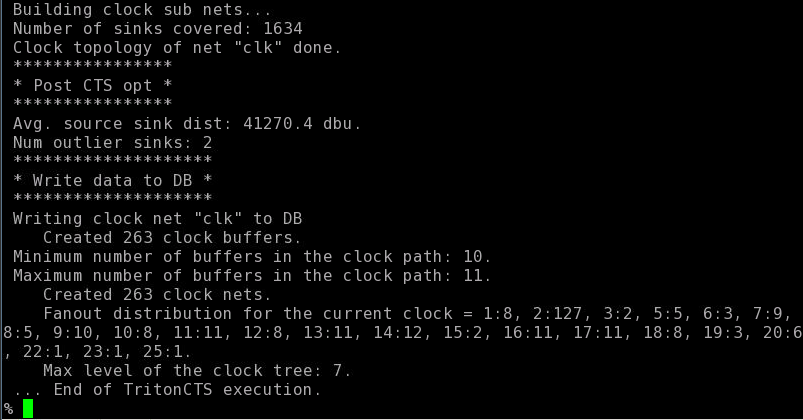 

Now for the timing analysis after CTS.

 openroad
 
We need to create a db file using .lef and .def. This is done using the following commands : 

    read_lef ......./tmp/merged.lef
    read_def ......./cts/picorv32a.cts.def
    write_db picorv32_cts.db
     
## Day 5: Final steps for RTL2GDS

Use the following commands before creating the power distribution network : 
 
     openroad
     read_db picorv32_cts.db  
     read_liberty $::env(LIB_SYNTH_COMPLETE) 
     link_design picorv32a
     read_sdc ...../src/my_base.sdc
     set_propagated_clock [all_clocks]
     report_checks -path_delay min_max -format full_clock_expanded -digits 4

For generating the power distribution network we use the following command : 

    gen_pdn
    
After running the command the result will look something like this : 

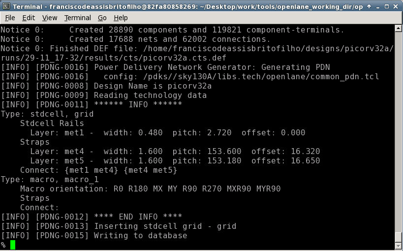 

The next step is running the Routing and this can be done via the command : 

    run_routing
    
After routing the if we open the design in magic the result should look like :

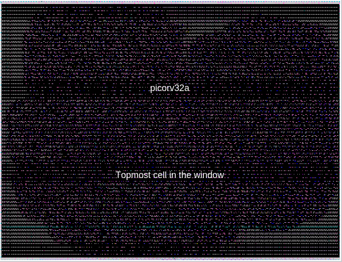 

Now run the SPEF extractor to extract the parasitics.

    cd SPEF_EXTRACTOR
    python3 main.py <lef file path> <def file path>
    
For the final GDSII file run the following command : 

    run_magic
    
## Acknowledgement
### Kunal Ghosh, Co-founder (VSD Corp. Pvt. Ltd)
### Nickson Jose, VLSI Engineer
    

